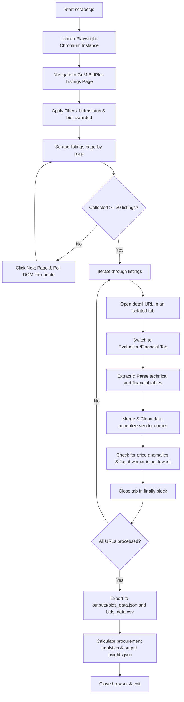

# GeM BidPlus Procurement Scraper & Analytics System

An industry-grade, modular, and resilient data extraction pipeline built with **Node.js** and **Playwright** for scraping, cleaning, and analyzing procurement bid results from the Government e-Marketplace (GeM) BidPlus portal.

---

## Architecture & Features

This system utilizes a highly modular structure to extract, normalize, analyze, and format procurement data from the live GeM portal:

```
gemedge_assignment/
├── outputs/               # Saved JSON & CSV datasets and analytics insights
│   ├── bids_data.json     # Hierarchical clean bid records
│   ├── bids_data.csv      # Flat multi-row relational spreadsheet matching vendors
│   └── insights.json      # Analytical summary of procurement statistics
├── scraper/
│   └── extractors.js      # Scrapes bid listing cards & drill-down result tables
├── utils/
│   ├── dataCleaner.js     # Sanitizes names, values, duplicates & flags anomalies
│   └── logger.js          # Colored log helper with timestamps & severity levels
├── scraper.js             # Main orchestrator managing filters, pagination & pipeline
├── saveCsv.js             # Serializer for structured JSON and flat multi-row CSV
└── insights.js            # Analytical reporting engine for procurement statistics
```

### Key Technical Achievements:
* **Resilient Multi-Packet Parser**: Dynamically classifies and extracts data from both single-packet and multi-packet tables.
* **Header-Based Column Mapping**: Maps columns dynamically based on header text matches (`Seller Name`, `Price`, `Rank`, `Status`), avoiding brittle, hardcoded index selections.
* **Tab-Isolated Execution Context**: Opens detail views in dedicated page contexts (tabs) and closes them in `finally` blocks, preserving parent page filtration state and pagination without leaking memory.
* **Post-Scraping Data Integrity & Anomaly Detection**:
  * Cleans and normalizes seller names, stripping regulatory category tags like `(MSE)`, `(MII)` for accurate tracking.
  * Automatically flags price anomalies where the awarded winner's price is not the lowest bid among qualified vendors.
* **Graceful Error Handling**: Implements exponential backoff retry logic for web navigation, allowing the scraper to recover from temporary server lag.

---

## Project Workflow

The project's end-to-end operational pipeline is structured as follows:



---

## Setup & Execution

### Prerequisites
* **Node.js** (v16 or higher)
* **npm**

### Installation

1. Clone this repository:
   ```bash
   git clone https://github.com/vanosaur/gemedge-scraper.git
   cd gemedge_assignment
   ```

2. Install the required dependencies:
   ```bash
   npm install
   ```

3. Ensure Playwright browsers are installed:
   ```bash
   npx playwright install chromium
   ```

### Execution

Run the main orchestrator script:
```bash
node scraper.js
```

The script will launch a headless Chromium instance, navigate to the portal, apply search filters (status = active, result = awarded), collect 30+ bid listings across multiple pages, drill down into each bid's evaluation details, normalize the extracted data, and generate output files in the `outputs/` folder.

---

## Outputs & Insights

Upon completion, three main files are generated under `outputs/`:

### 1. `bids_data.json`
A hierarchical, structured JSON file mapping each bid to its detailed metadata and list of participating vendors.

### 2. `bids_data.csv`
A flattened, multi-row relational spreadsheet matching bid details with their corresponding participant vendors. Excellent for import into business intelligence tools like Tableau, PowerBI, or Excel.

### 3. `insights.json`
An analytics report summarizing procurement metrics:
* **Participation Rate**: Percentage of bids with more than 2 participating bidders.
* **L1 vs L2 Price Gap**: Average absolute and percentage price gap between the winning bidder (L1) and the runner-up (L2) to analyze competition tightness.
* **Repeat Winners**: Listing of vendors ranked by the frequency of winning contracts.

#### Example Output (`insights.json`):
```json
{
  "total_bids_analyzed": 31,
  "high_participation": {
    "bids_with_gt_2_participants": 23,
    "percentage": 74.19
  },
  "l1_l2_price_gap": {
    "bids_with_l1_l2_comparison": 23,
    "average_absolute_gap": 9742.98,
    "average_percentage_gap": 8.05
  },
  "repeat_winners": [
    {
      "vendor_name": "ARMY TRADERS",
      "win_count": 1
    },
    {
      "vendor_name": "MONI ENTERPRISES",
      "win_count": 1
    }
  ]
}
```

---

## Selector Inspection & Best Practices

Scraping dynamic enterprise and government portals requires a specialized set of techniques:

### 1. Handling Dynamic Content Loading
* **Observation**: Filters on the BidPlus portal trigger asynchronous AJAX refreshes rather than traditional page refreshes.
* **Best Practice**: After checking the `#bidrastatus` and `#bid_awarded` checkmarks, the scraper waits for a 5-second buffer or listens for network idle state to ensure the page has refreshed.
* **Pagination**: The Next button (`a.page-link.next`) modifies the URI hash (`#page-X`). We dynamically verify page transitions by storing the first bid ID on the current page and waiting for the DOM to update to a different first bid ID.

### 2. Bypass Detection & Politeness
* **User-Agent Spoofing**: We construct a browser context using a modern Chrome user-agent string to prevent default headless headers from triggering firewalls.
* **Viewport Constraints**: Setting a standard viewport simulates genuine user displays.
* **Rate-Limiting (Politeness Delay)**: The orchestrator introduces a 1000ms delay between processing each drill-down URL. This protects the server from traffic spikes and ensures stable sessions.
* **Session Maintenance**: Instead of scraping details concurrently, the scraper traverses detail links sequentially to prevent session invalidation or IP bans.

---

## Error Handling & Resiliency

Procurement portals can experience transient network failures. This system is built with resilience in mind:
* **Exponential Backoff**: If a page navigation fails, it waits for `2000 * attempt` milliseconds before retrying, giving the portal server breathing room during load spikes.
* **Isolated Try-Catch**: If a single drill-down detail extraction fails (e.g., corrupted table structure or session timeout), the scraper logs the error, closes the tab, and proceeds to the next bid, ensuring one corrupt record doesn't sink the entire run.
* **Finally Blocks**: Crucial cleanups, such as closing tabs and closing the main browser instance, are placed inside `finally` blocks to prevent memory leaks and zombie browser processes.

---

## Future Improvements

* **IP & Proxy Rotation**: Integrate proxy rotation (e.g., residential proxies) to support large-scale scraping without IP blocking or CAPTCHA triggers.
* **State Checkpointing**: Persist progress locally so that if a scrape is interrupted, it can resume from the last successful bid instead of restarting.
* **Database Storage**: Store extracted data in a relational database (e.g., PostgreSQL) or Document Store (e.g., MongoDB) instead of flat files for incremental updates.
* **Visual Testing**: Write automated integration tests with saved HTML snapshots to quickly detect if the portal makes changes to its CSS selectors or DOM hierarchy.
